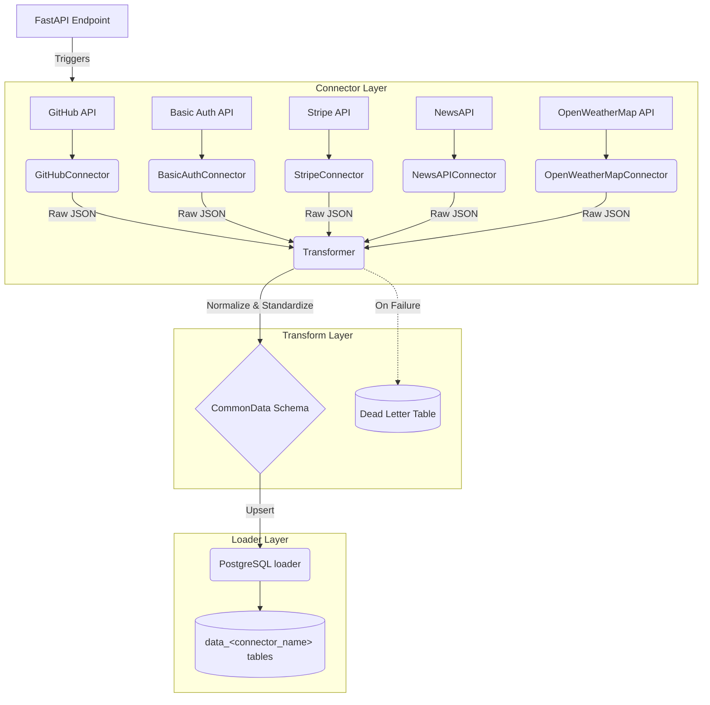

# Multi-Source Data Connector Pipeline

A scalable, extensible data pipeline built with Python, FastAPI, and PostgreSQL to extract, transform, and load (ETL) data from various APIs into a centralized database.

## Architecture

The pipeline strictly follows a 3-layer architecture for modularity and maintainability:



## Connectors

| Connector | Auth style | Pagination |
|---|---|---|
| GitHub | Bearer token | Link-header, page-based |
| Basic Auth API | HTTP basic auth | none |
| Stripe | Bearer token | cursor (`starting_after`) |
| NewsAPI | API key header | single page |
| OpenWeatherMap | API key query param | none |

## Features
- **Extensible Connectors**: Base abstract class to easily add new sources with genuinely different auth/pagination styles. Handles authentication and pagination.
- **Resiliency**: Built-in exponential backoff retries (via `tenacity`) for rate-limiting (HTTP 429).
- **Idempotent Loading**: PostgreSQL `ON CONFLICT DO UPDATE` on a dynamically named table per source (`data_<connector_name>`) ensures no duplicate records on multiple runs.
- **Dead Letter Queue**: Failed records during transformation or loading are logged to a `failed_records` table for debugging.
- **Health Checks**: `/health` endpoint to monitor API and Database connection status.

## Getting Started

1. Copy `.env.example` to `.env` and fill in your secrets.
2. Spin up the infrastructure using Docker:
   ```bash
   docker compose up --build
   ```
3. Check the API health:
   ```bash
   curl http://localhost:8000/health
   ```
4. Trigger a sync manually via the interactive documentation at [http://localhost:8000/docs](http://localhost:8000/docs).

## Testing
Unit tests are written using `pytest`. Database operations are mocked to ensure fast, isolated testing.

```bash
pip install -r requirements.txt
pytest tests/
```
